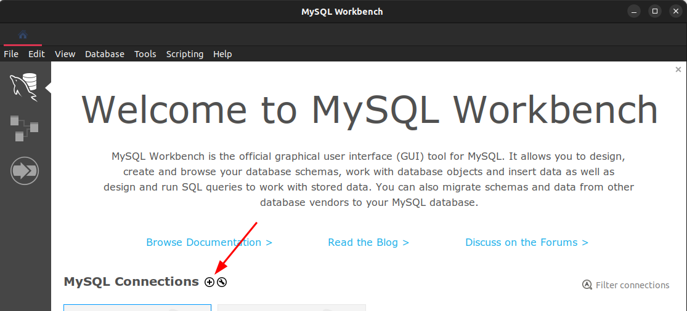
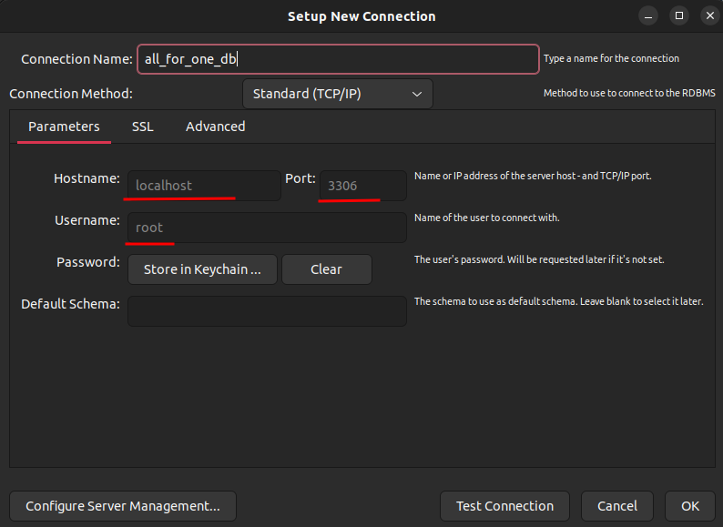
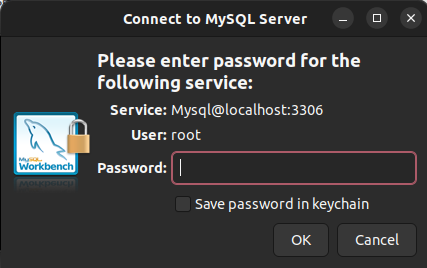

# All for one

## Contexto

Este projeto trata-se de uma série de desafios com diferentes níveis de complexidade que devem ser resolvidos cada um em seu arquivo próprio. O arquivo desafioN.. tem apenas o código SQL do desafio resolvido.

> Utiliza o banco de dados [`Northwind`](northwind.sql)

## Técnologias usadas

Back-end:
> Desenvolvido usando: MySQL, Docker Compose

## Habilidades

Adquiri essas habilidades ao desenvolver esse projeto:

## Instalando Dependências

- clone o projeto:

  ```bash
  git clone git@github.com:Andreyrvs/22-mysql-all-for-one.git
  ```

  > Back-end

  ```bash
  cd 22-mysql-all-for-one
  #  Rode os serviços node e db com o comando.
  docker-compose up -d
  #  acesso ao terminal interativo do container criado pelo compose.
  docker exec -it all_for_one bash
  npm install
  ```

## Executando aplicação

É necessário ter [Mysql Workbench](https://www.mysql.com/products/workbench/) Para rodar a as Queryes.

| 1. Crie uma nova coneção | 2. Utilize as credenciais |
| ----------- | ----------- |
|  |  |
| 3. Utilize a senha: `password`  | 4. abra o aquivo `northwind.sql` e copie `CTRL+A`e `CTRL+C`. Vá no **workbench** abra uma nova janela de query e cole o conteudo, depois clique no ícone de raio para executar a query|
|  |  |

Tudo Setup pronto :happy:
Cada desafio é uma query Sql. é possovivel importar cada uma ou copiar o código dentro do arquivo e colar na janela de query do **workbench**
